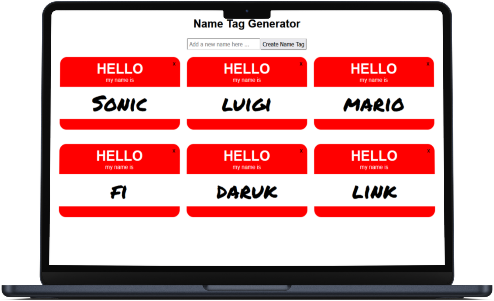

# Name Tag Generator

An interactive name tag generator that allows the user to add or delete name tags, and the data is stored to local storage across different sessions.

## Project Details

### View My Project: [https://n9gh98.csb.app/](https://n9gh98.csb.app/) 

## Features

- Input names for new tags
- Delete any tags no longer needed
- Data is saved between sessions with lifecycle methods

## Technologies Used

- React
- CSS3
- JSX

## Acknowledgements

Project Idea: [Skillcrush](https://Skillcrush.com)

Original CSS provided by: [Skillcrush](https://Skillcrush.com)